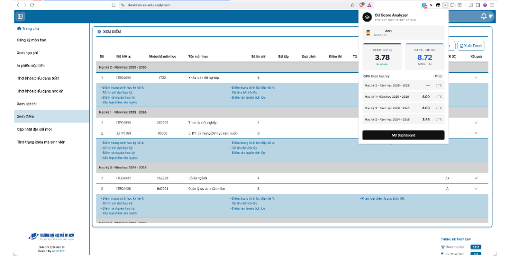
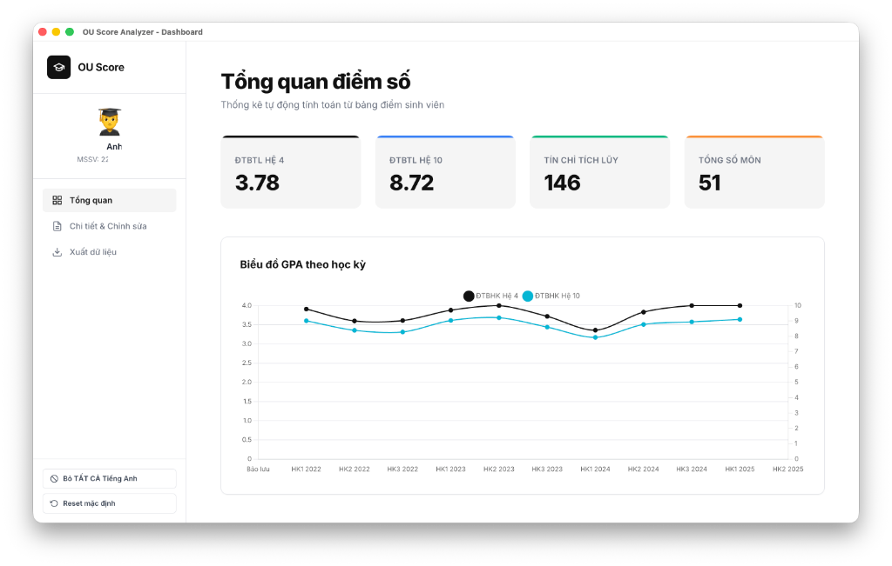
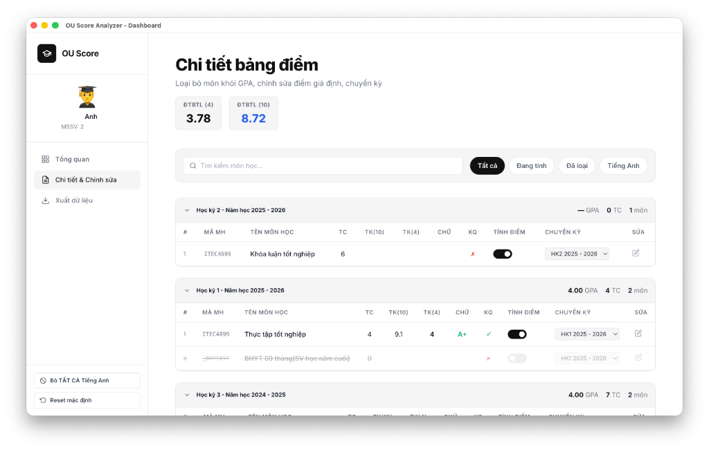

# OU Score Analyzer

A powerful and modern Chrome Extension for students of Ho Chi Minh City Open University (OU).
It provides an elegant dashboard to view, analyze, and simulate your academic performance (GPA).

## Ảnh chụp màn hình (Screenshots)

### 1. Tiện ích popup trên trang điểm OU (Popup Preview)
<p align="center">
  
</p>

### 2. Tổng quan điểm số (Dashboard Overview)
<p align="center">
  
</p>

### 3. Chi tiết bảng điểm & Chỉnh sửa (Dashboard Details & Editing)
<p align="center">
  
</p>

## Tính năng chính (Features)
- **Giao diện hiện đại (Modern Dashboard)**: Giao diện sáng sủa (Light SaaS), sang trọng và thân thiện được xây dựng trên nền tảng Tailwind CSS.
- **Tính toán chuẩn xác**: Tự động tính điểm trung bình tích lũy và ĐTB học kỳ (theo cả hệ 4 và hệ 10).
- **Phân tích giả định (What-If Analysis)**: Cho phép chỉnh sửa điểm tạm thời của bất kì môn học nào để dự đoán GPA tương lai. Điểm giả định sẽ được tô sáng để dễ dàng phân biệt.
- **Tùy biến môn học**: Cho phép loại bỏ nhanh môn học (VD: các môn tiếng Anh, GDTC) khỏi danh sách tính điểm hoặc di chuyển môn học giữa các học kỳ.
- **Biểu đồ trực quan**: Vẽ biểu đồ trực quan biến động GPA qua các học kỳ với Chart.js.
- **Xuất dữ liệu linh hoạt**: Hỗ trợ xuất dữ liệu ra file CSV (Excel) hoặc tải trực tiếp ảnh thống kê PNG sắc nét (không lỗi font hay đè chữ nhờ kỹ thuật Absolute Positioning khi render với html2canvas).

## Hướng dẫn cài đặt (Installation)
1. Mở trình duyệt Chrome và truy cập `chrome://extensions/`.
2. Bật chế độ **Developer mode** ở góc trên cùng bên phải.
3. Nhấp vào **Load unpacked** và chọn thư mục chứa mã nguồn extension này (`score_extension`).
4. Đăng nhập vào trang [Tiện ích Sinh viên OU](https://tienichsv.ou.edu.vn/#/diem).
5. Nhấn vào biểu tượng extension trên thanh công cụ (Toolbar) và mở Dashboard để sử dụng!

## Công nghệ sử dụng (Tech Stack)
- **Manifest V3** Chrome Extension (Bảo mật tối đa, không dùng inline scripts/CDN).
- **Vanilla JS** (Không dùng Framework để tối ưu hiệu năng).
- **Tailwind CSS** (Được biên dịch sẵn trong `style.css` để vượt qua Content Security Policy).
- **Chart.js v4** (Vẽ biểu đồ).
- **html2canvas v1** (Chụp ảnh màn hình Dashboard).

## Phát triển mở rộng (Development)
Nếu bạn muốn thay đổi giao diện, hãy chỉnh sửa các class Tailwind trong `dashboard.html` / `popup.html` và chạy lệnh biên dịch lại CSS (yêu cầu cài đặt Tailwind CLI):
```bash
npx tailwindcss -i input.css -o style.css
```
*(File style.css hiện tại đã được biên dịch sẵn nên bạn có thể sử dụng ngay mà không cần chạy lệnh).*
